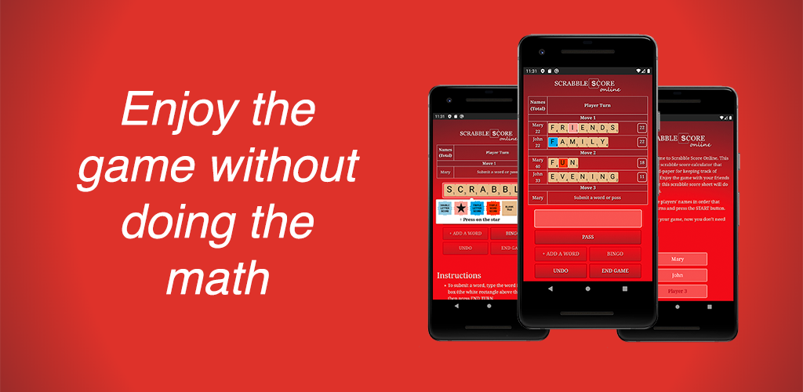

# Scrabble Score Online



Scrabble Score Online is an easy-to-use tool that replaces pen-and-paper for keeping track of Scrabble Scores.
Enjoy the game with your friends and family while this Scrabble Score Keeper does the math for you.

Features
- Supports official Scrabble scoring rules, including leftovers accounting
- Shows detailed game progress
- Supports unlimited undo
- Restores score sheets when relaunching the app

Limitations
- Does not validate words against the Scrabble Dictionary
- Only supports the english language
- Does not archive score sheets

Download it on [App Store](https://apps.apple.com/us/app/scrabble-score-calculator/id1497216063) or [Play Market](https://play.google.com/store/apps/details?id=com.saintmarina.scrabblescore).

SCRABBLE® is a registered trademark. All intellectual property rights in and to the game are owned in the USA and Canada by Hasbro Inc., and throughout the rest of the world by Mattel, Inc.


## Development environment setup

1. Install npm. Follow the instruction provided [here](https://www.npmjs.com/get-npm).
2. Run the following in your terminal:

```
git clone https://github.com/saintmarina/scrabblescore.online.git
cd scrabblescore.online/
npm install
npm start
```
The homepage should open in your browser.

## How to run tests

Run `npm run test` in your terminal
